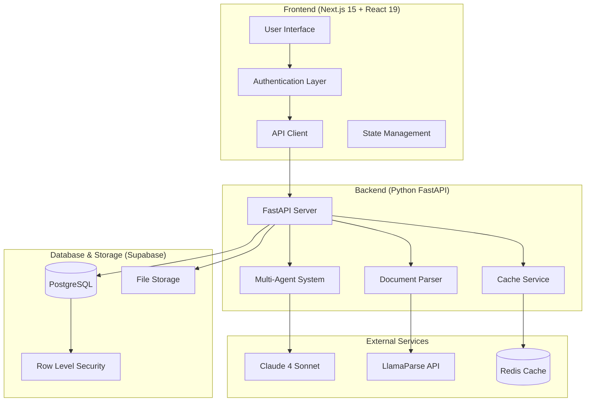
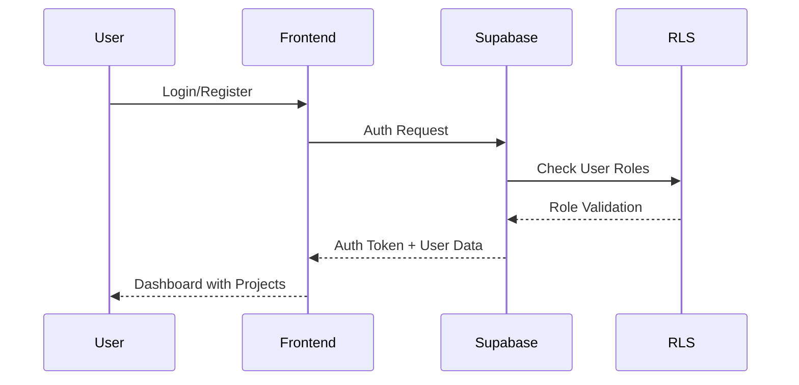
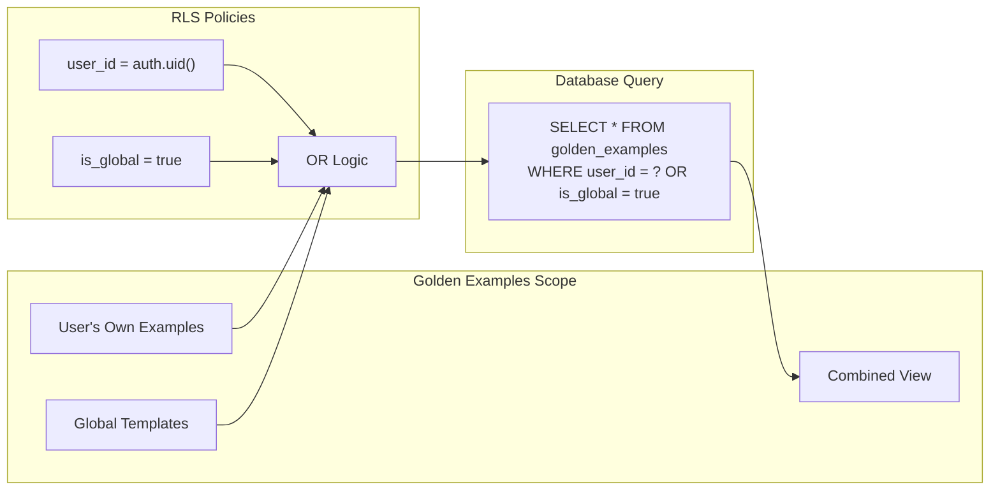
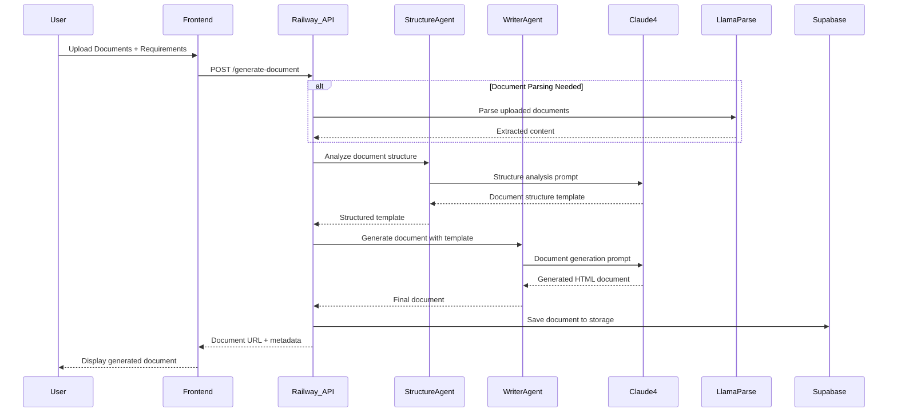
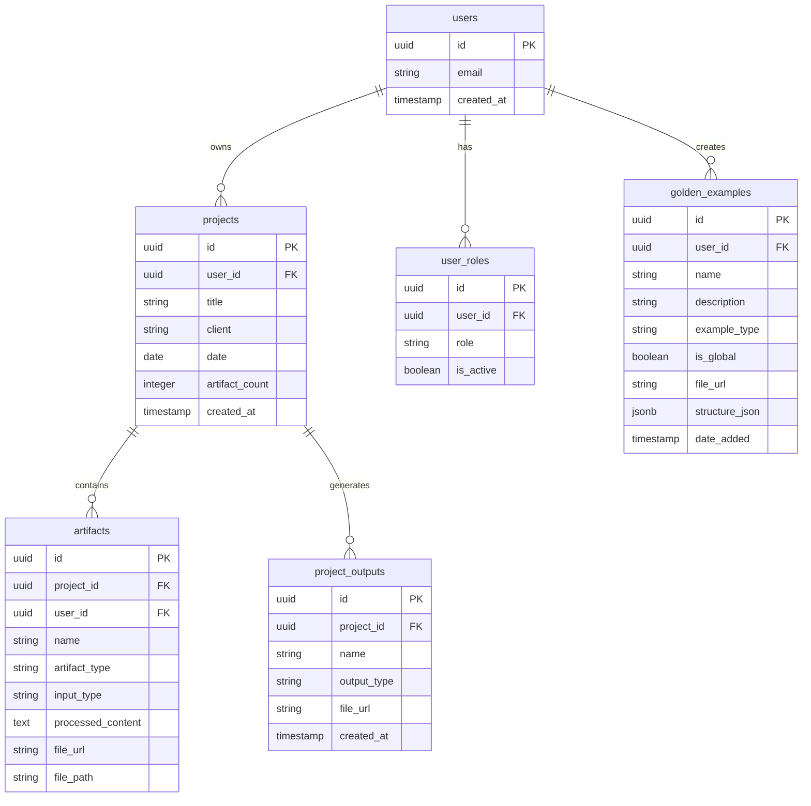
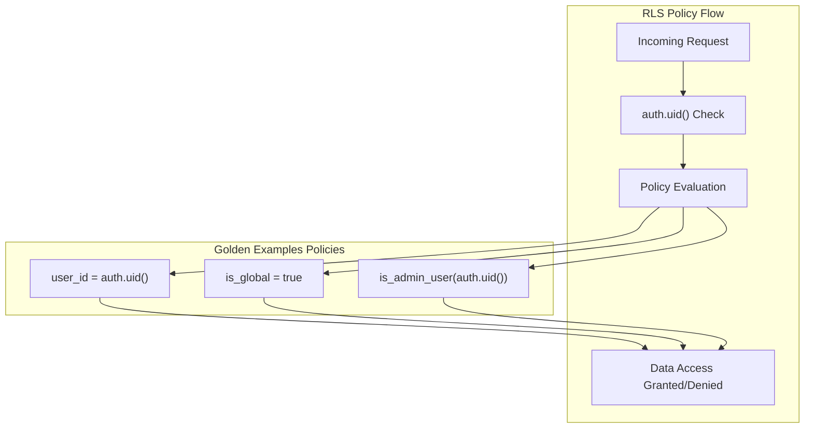
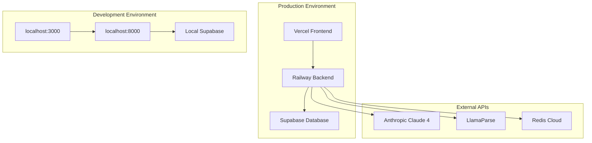
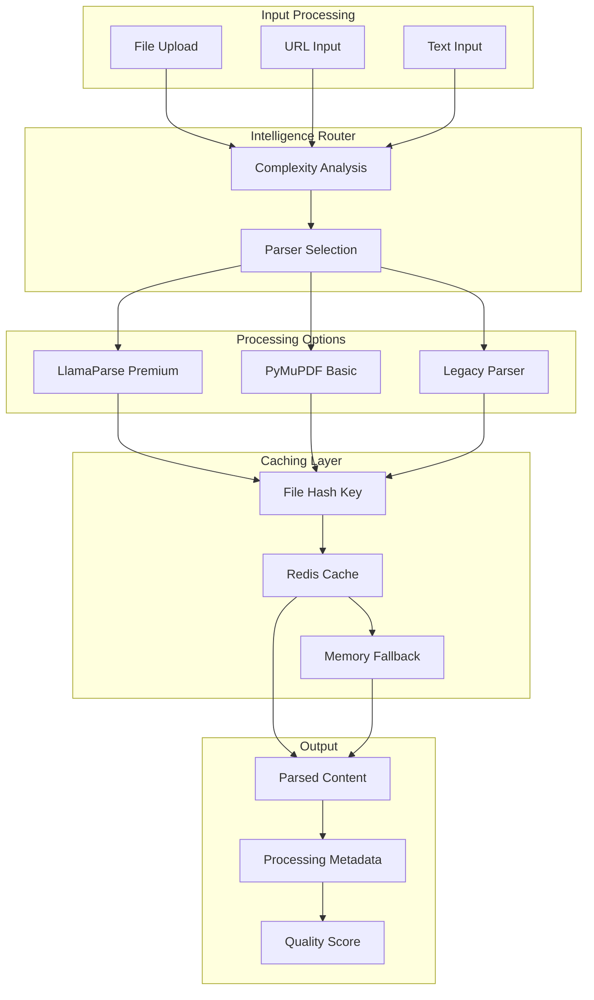

# Search Wizard - System Architecture Diagram

## High-Level Architecture Overview



## Detailed Data Flow

### 1. User Authentication & Project Management



### 2. Golden Examples System



### 3. Document Generation Flow



## Component Architecture Details

### 1. Frontend Architecture (Next.js)

```mermaid
graph TB
    subgraph "Pages & Routing"
        DASHBOARD[Dashboard /]
        PROJECTS[Projects /projects/[id]]
        AUTH_PAGES[Auth Pages /login /register]
        ADMIN[Admin /admin]
    end

    subgraph "Components"
        PROJECT_CARD[ProjectCard]
        ARTIFACT_UPLOAD[ArtifactUpload]
        DOCUMENT_GEN[DocumentGeneration]
        GOLDEN_POPUP[GoldenExamplesPopup]
    end

    subgraph "State Management"
        AUTH_CONTEXT[AuthContext]
        ERROR_CONTEXT[ErrorContext]
        THEME_CONTEXT[ThemeContext]
    end

    subgraph "API Layer"
        PROJECT_API[projectApi.js]
        STORAGE_API[storageApi.js]
        SUPABASE_CLIENT[supabase.js]
    end

    DASHBOARD --> PROJECT_CARD
    PROJECTS --> ARTIFACT_UPLOAD
    PROJECTS --> DOCUMENT_GEN
    PROJECTS --> GOLDEN_POPUP
    
    PROJECT_CARD --> AUTH_CONTEXT
    ARTIFACT_UPLOAD --> PROJECT_API
    DOCUMENT_GEN --> STORAGE_API
    GOLDEN_POPUP --> SUPABASE_CLIENT
```

### 2. Backend Architecture (FastAPI)

```mermaid
graph TB
    subgraph "API Endpoints"
        HEALTH[/health]
        GENERATE[/generate-document]
        ANALYZE[/analyze-structure]
        PROCESS[/process-content]
    end

    subgraph "Multi-Agent System"
        STRUCTURE[StructureAgent]
        WRITER[WriterAgent]
        KB_SUPPORT[KB Support]
    end

    subgraph "Services"
        LLAMAPARSE_CLIENT[LlamaParseClient]
        DOC_PARSER[DocumentParserService]
        CACHE_SERVICE[CacheService]
    end

    subgraph "Agent Wrappers"
        ANTHROPIC[AnthropicAgent]
        OPENAI[OpenAIAgent]
        GEMINI[GeminiAgent]
    end

    GENERATE --> STRUCTURE
    GENERATE --> WRITER
    ANALYZE --> STRUCTURE
    PROCESS --> DOC_PARSER

    STRUCTURE --> ANTHROPIC
    WRITER --> ANTHROPIC
    DOC_PARSER --> LLAMAPARSE_CLIENT
    LLAMAPARSE_CLIENT --> CACHE_SERVICE
```

### 3. Database Schema (Supabase)



## Security Architecture

### Row Level Security (RLS) Policies



## Deployment Architecture



## Document Processing Pipeline



## Key Features Summary

### ✅ Multi-Agent AI System
- **StructureAgent**: Analyzes documents to extract structural patterns
- **WriterAgent**: Generates new documents using Claude 4 Sonnet
- **Knowledge Base Support**: Enhances prompts with domain knowledge

### ✅ Advanced Document Processing
- **LlamaParse Integration**: 95%+ accuracy OCR and table extraction
- **Intelligent Routing**: Automatic parser selection based on complexity
- **Caching System**: Redis-based with memory fallback for performance

### ✅ User-Scoped Golden Examples
- **Personal Templates**: Users can create and manage their own templates
- **Global Access**: Templates are accessible across all user's projects
- **Security**: RLS policies ensure users only see their own + global templates

### ✅ Production-Ready Deployment
- **Frontend**: Vercel (Next.js 15 + React 19)
- **Backend**: Railway (Python FastAPI + Claude 4)
- **Database**: Supabase (PostgreSQL + Storage)
- **Caching**: Redis for optimal performance

### ✅ Security & Authentication
- **Row Level Security**: Database-level access control
- **Admin System**: Role-based permissions and user management
- **Secure File Upload**: Validated uploads with proper storage